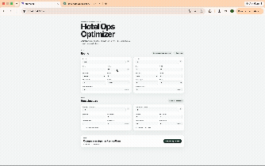
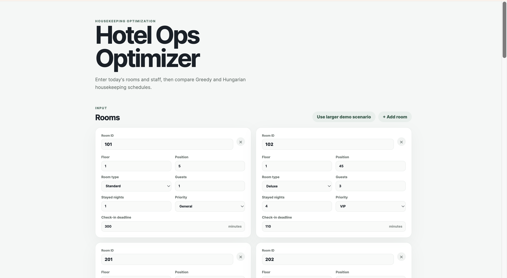
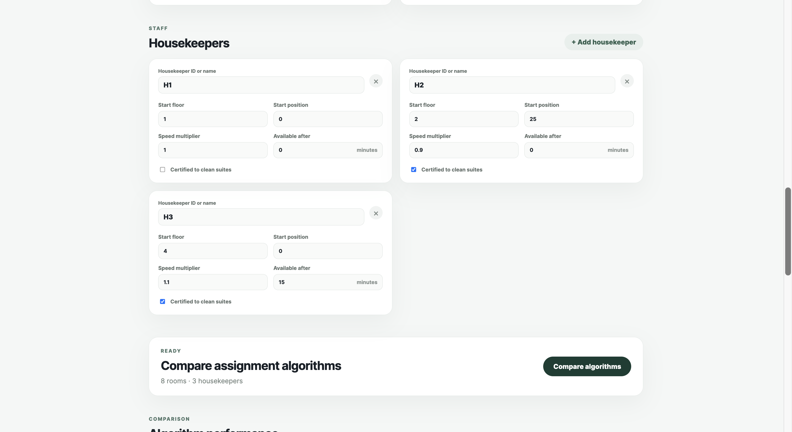
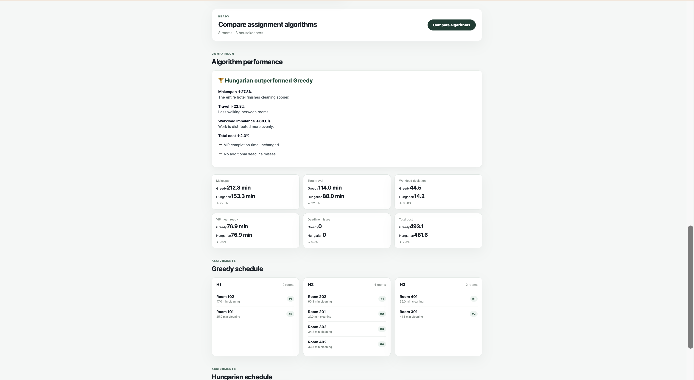
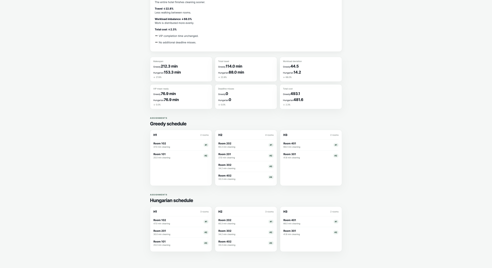

# 🏨 Hotel Ops Optimizer

An end-to-end optimization platform that generates efficient housekeeping schedules using the Hungarian Algorithm.




---

## Overview

Hotel housekeeping managers often assign rooms manually or using simple greedy heuristics. As the number of rooms and staff grows, these approaches can lead to:

- Long overall completion times
- Excessive staff travel
- Uneven workloads
- Missed high-priority rooms

Hotel Ops Optimizer models housekeeping scheduling as an assignment optimization problem and compares a Greedy baseline against the Hungarian Algorithm.

---

## Features

- Interactive React frontend
- FastAPI backend
- Hungarian assignment optimization
- Greedy baseline for comparison
- Automatic performance metrics
- Scenario benchmarking
- REST API
- Fully tested with pytest

---

## Algorithms

### Greedy

Assigns each room sequentially to the locally cheapest housekeeper.

Pros

- Fast
- Simple

Cons

- Doesn't consider the global optimum.

---

### Hungarian

Constructs a complete assignment cost matrix and computes the globally optimal assignment.

Optimizes

- Makespan
- Travel distance
- Workload balance
- Total assignment cost

---

## Metrics

Each generated schedule reports

- Makespan
- Total travel
- Workload standard deviation
- VIP completion time
- Deadline misses
- Total optimization cost

---

## Demo

### 1. Input Interface



### 2. Greedy vs Hungarian Comparison



### 3. Generated Housekeeping Schedule



### 4. Benchmark Results


---

## Tech Stack

Frontend

- React
- TypeScript
- Vite

Backend

- FastAPI
- Pydantic

Optimization

- NumPy
- SciPy
- Hungarian Algorithm

Testing

- pytest

---

## Project Structure

```text
backend/
engine/
frontend/
experiments/
tests/
```

---

## Running Locally

### Backend

```bash
python -m uvicorn backend.main:app --reload
```

### Frontend

```bash
cd frontend
npm install
npm run dev
```

---

## Benchmark

The repository includes a benchmark that compares Greedy and Hungarian across randomly generated hotel scenarios.

```bash
python -m experiments.benchmark2
```

Example output

```text
Makespan           ↓27.8%
Travel             ↓22.8%
Workload STD       ↓68.0%
Total Cost         ↓2.3%
```

---
## Documentation

Detailed project documentation is available in Google Drive: [Google Drive Folder](https://drive.google.com/drive/u/0/folders/1mfeK7ix8SiyJAVVtCKV1Qs0J_rruAPv5)

- Research and current solutions
- Project overview
- Algorithm and cost-function design
- Technical architecture

---
## Future Work

- Multi-day scheduling
- Shift constraints
- Dynamic room arrivals
- Interactive floor map
- Real hotel PMS integration

---

## Author

Jaewon Park
